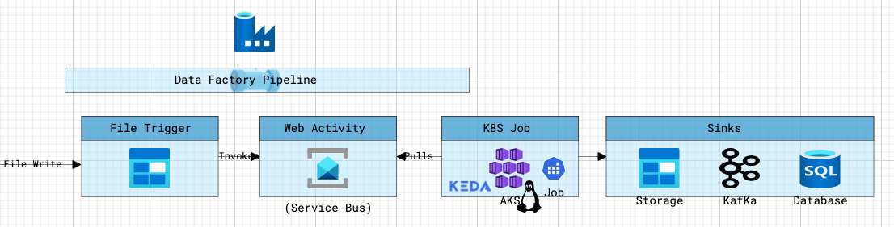

# Overview

This is to demo how to use Azure Data Factory with AKS/KEDA to run batch jobs in Azure

# Architecture 

# Deployment

### Prerequisite
* A Linux machine or Windows Subsytem for Linux or Docker for Windows 
* Azure Cli and an Azure Subscription
* Terraform 0.12 or greater
* Kubectl
* Helm
* A virtual network with 2 subnets defined - one for private endpoint and one for kubernetes
* DNS zones for storage private endpoints - [refrenece](https://docs.microsoft.com/en-us/azure/storage/common/storage-private-endpoints)
* An Azure Container Repository 

## Infrastructure 
1. az extension add --name aks-preview
1. az extension update --name aks-preview
1. az login
1. az feature register --namespace "Microsoft.ContainerService" --name "AKS-AzureKeyVaultSecretsProvider"
1. az feature register --namespace "Microsoft.ContainerService" --name "EnablePodIdentityPreview"
1. az feature register --namespace "Microsoft.ContainerService" --name "AKS-OpenServiceMesh"
1. az feature register --namespace "Microsoft.ContainerService" --name "DisableLocalAccountsPreview"
1. az feature list -o table --query "[?contains(name, 'Microsoft.ContainerService')].{Name:name,State:properties.state}"
1. Wait till the above features are enabled.  
1. Update uat.tfvars with values for your environment 
1. az provider register --namespace Microsoft.ContainerService
1. cd infrastructure
1. terraform init -backend=true -backend-config="access_key=${access_key}" -backend-config="key=uat.terraform.tfstate"
1. terraform plan -out="uat.plan" -var "resource_group_name=DevSub_K8S_RG" -var-file="uat.tfvars"
1. terraform apply -auto-approve "uat.plan"
1. ./aks-keda-install.sh $SUBSCRIPTION_ID $RG $CLUSTER_NAME $KEDA_IDENTITY $BATCH_IDENTITY

## Source
### Build
1. cd source
1. az login
1. az acr login -n ${ACR_NAME}
1. docker build -f DOCKERFILE -t ${ACR_NAME}.azurecr.io/queue-processor:{BUILD_ID} .
1. docker push ${ACR_NAME}.azurecr.io/queue-processor:{BUILD_ID}

### Deploy
1. cd chart
1. Update values.yaml
1. helm upgrade -i batchdemo .

## Datafactory Pipeline 
_TBD_

# Validation 
_TBD_

# Backlog 
- [ ] Update Readme with additional details